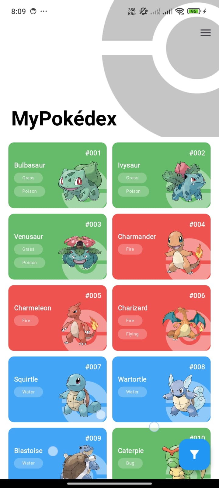
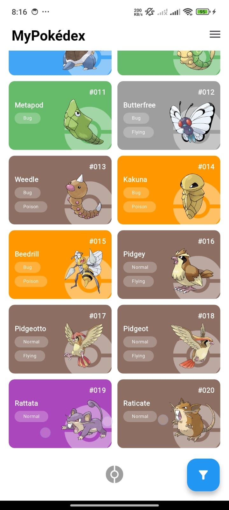
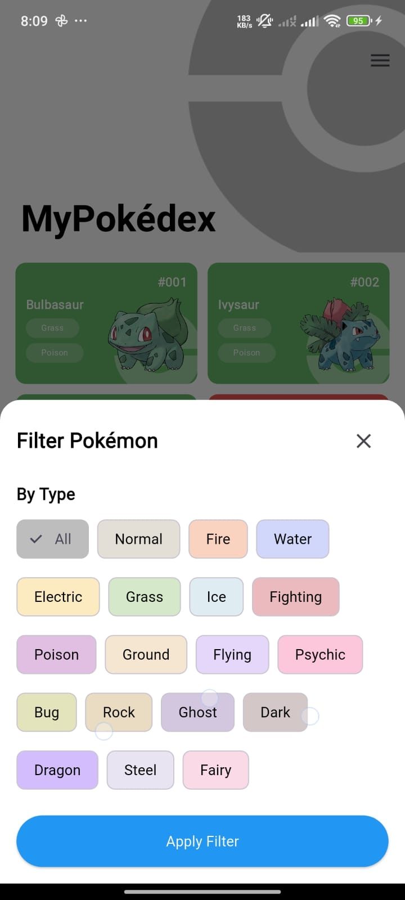
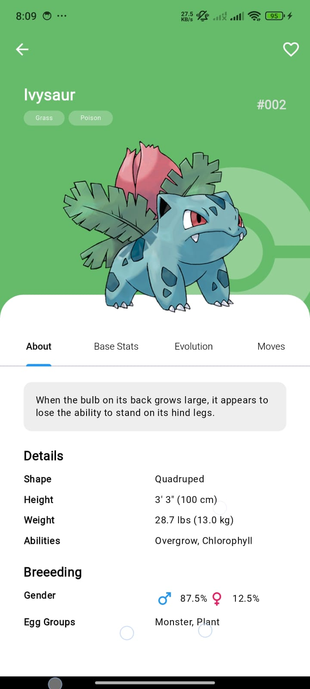
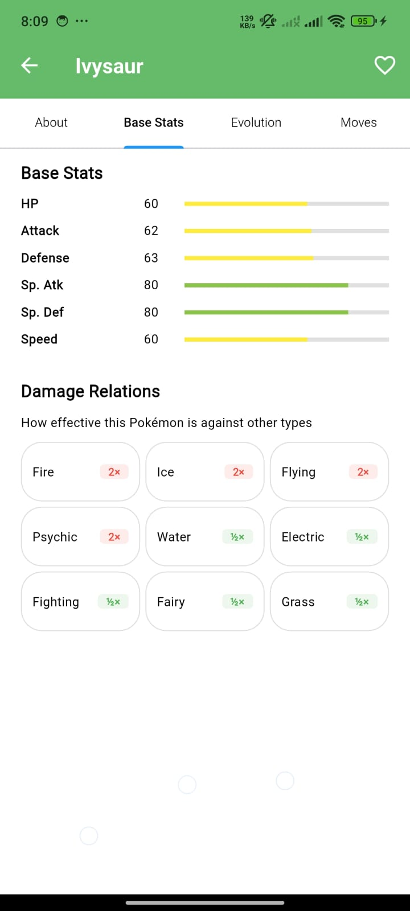
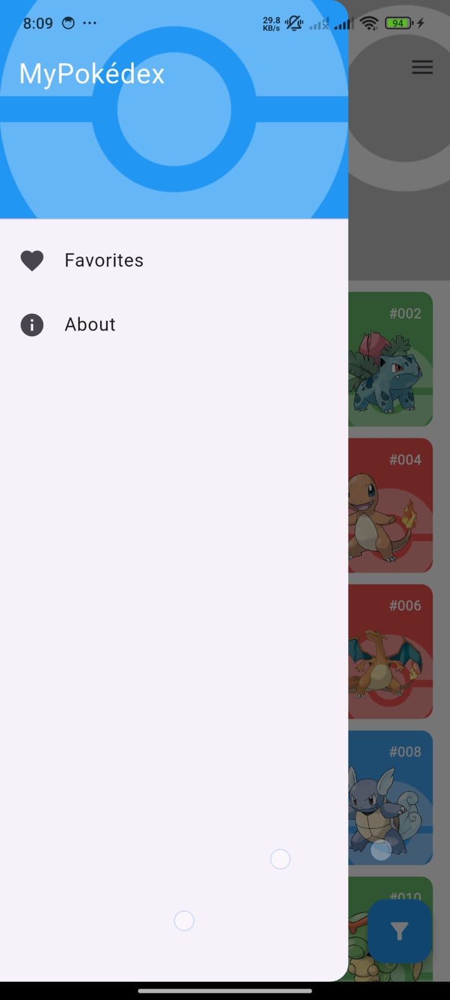

# 🔴 My Pokédex

A Pokédex application built with Flutter and GetX for state management, created as part of a technical test interview.

## 📱 Overview

This Pokédex app allows users to browse through Pokémon using the [PokéAPI](https://pokeapi.co/). The UI and features were designed based on the recruiter's requirements with some custom adjustments to enhance user experience.

## 📷 Screenshots

<p align="center">
    
    
    
    
    
    
    
    
</p>


## ✨ Features

- Browse Pokémon with infinite scrolling and pagination
- Filter Pokémon by type
- View detailed information about each Pokémon (stats, evolution, moves, etc.)
- Add and remove Pokémon as favorites
- Responsive design for both portrait and landscape orientations
- Efficient state management using GetX
- Custom loading animation with Pokéball imagery
- Shimmer effect for loading placeholders

## 🛠️ Technologies Used

- Flutter for cross-platform mobile development
- GetX for state management and clean architecture
- PokéAPI as the data source
- Responsive design principles
- Google Fonts for typography
- Shimmer for loading animations

## 📝 Implementation Notes

This app was intentionally designed with simplicity in mind due to time constraints for the technical interview, while still maintaining a clean architecture approach using GetX. Some technical details:

- Network layer uses a straightforward implementation without complex exception handling
- Local storage is implemented using SharedPreferences for favorite Pokémon persistence
- Data models maintain minimal structure for efficiency
- Some API responses are parsed directly where dedicated models weren't necessary
- Clean architecture principles are applied through GetX pattern
- **Infinite scrolling**: Implemented using pagination to optimize performance and memory usage
- **Responsive design**: Flexible layouts that adapt to different screen orientations
- **Type filtering**: Quick access to Pokémon filtered by their elemental types
- **Favorites system**: Persistent storage of user preferences across app sessions
- **Custom loading states**: Implemented shimmer loading placeholders and animated Pokéball loading indicators

## 🔄 State Management

The app uses GetX for:
- Reactive state management
- Dependency injection
- Route management
- Separation of UI, business logic, and data layers

## 🚀 Installation

```bash
# Clone the repository
git clone https://github.com/yourusername/mypokedex.git

# Navigate to the project folder
cd mypokedex

# Install dependencies
flutter pub get

# Run the app
flutter run
```

## 📄 License

This project is created for interview purposes only.
